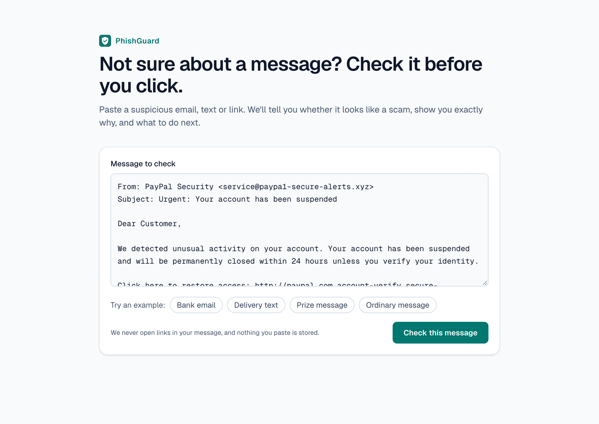
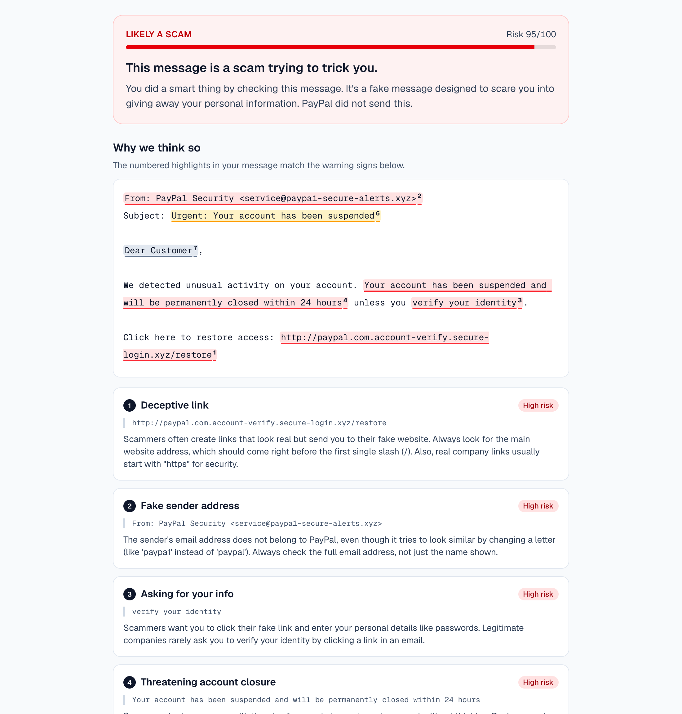
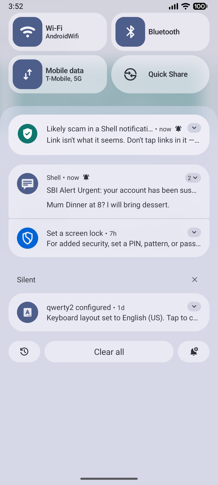
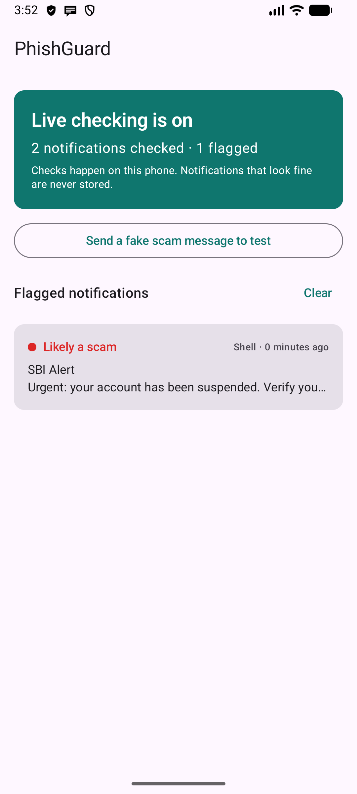
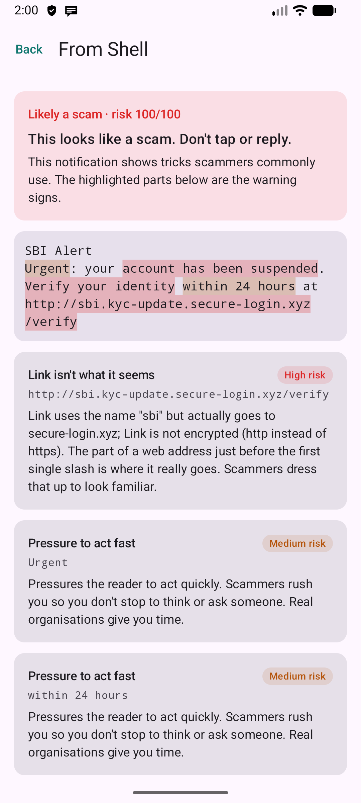
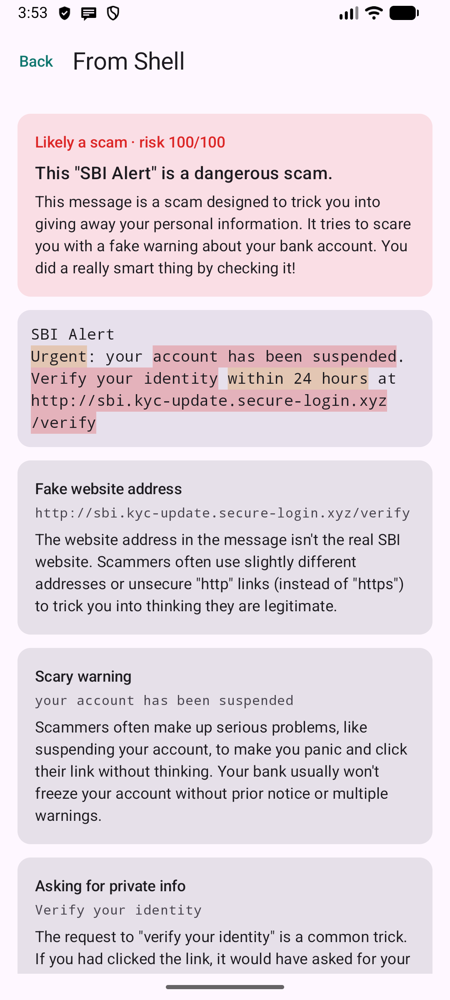
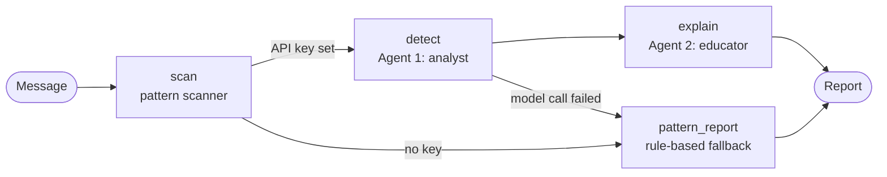

<div align="center">


# PhishGuard

**The explainable security agent.** It doesn't just say "scam" — it shows you why, and what to do next.

[](https://phishguard.sonu-kumar.in/)
[](https://github.com/notysozu/PhishGuard/actions/workflows/ci.yml)
[](LICENSE)

Next.js · LangGraph · Gemini · Kotlin / Jetpack Compose

</div>

Most phishing filters return a verdict and nothing else, so people never learn
what to look for. PhishGuard is built for non-technical users: paste a
suspicious email, text or link and it highlights the exact phrases and links
that are warning signs, explains each trick in plain language, and gives
concrete safety steps. An Android companion app does the same for every
notification on the phone, live, as it arrives.

## Screenshots

### Web

| Paste a message | Explained result |
| --- | --- |
|  |  |

### Android

| Live warning | Home | Why it was flagged | AI explanation |
| --- | --- | --- | --- |
|  |  |  |  |

All screenshots are from the running apps: the web shots from the live
deployment, the Android shots from an emulator calling that same deployment.

## What it does

- **Explains, not just classifies.** Every warning sign is tied to a verbatim
  quote from the message, highlighted in place and numbered.
- **Two agents with separate jobs.** A security analyst produces a structured,
  technical verdict. An educator rewrites it in calm, jargon-free language. The
  educator cannot change the verdict.
- **Works without AI.** A deterministic scanner runs first. If the model is
  unavailable or no key is set, you still get a labelled, rule-based report.
- **Live protection on Android.** A notification listener scores each incoming
  notification on the device and posts a warning within seconds.
- **Actionable.** Each report ends with "what to do now" and "if you already
  clicked, replied or paid".

## How it works



The workflow is a LangGraph `StateGraph` in
[lib/phishguard/graph.ts](lib/phishguard/graph.ts).

| Node | What it does |
| --- | --- |
| `scan` | Deterministic scanner ([signals.ts](lib/phishguard/signals.ts)): look-alike and mismatched domains, digit-for-letter swaps, link shorteners, raw-IP links, spoofed senders, urgency, threats, credential and payment requests. |
| `detect` | Agent 1. Confirms or rejects the scanner's hints, adds what it missed, and returns a schema-constrained verdict with verbatim evidence quotes. |
| `explain` | Agent 2. Turns the analyst's findings into plain-language explanations plus safety and recovery steps. |
| `pattern_report` | Fallback that builds the report from scanner results and template wording. |

On Android, [PhishNotificationListener](android/app/src/main/java/com/phishguard/app/PhishNotificationListener.kt)
runs a Kotlin port of the same scanner
([PhishScanner.kt](android/app/src/main/java/com/phishguard/app/PhishScanner.kt))
on the device. Only when the user taps **Explain with AI** on a flagged message
is that one message sent to the server.

## Project layout

```
app/                    Next.js routes
  page.tsx              The page (server component)
  api/analyze/          NDJSON stream for the web page (shows progress per step)
  api/v1/analyze/       JSON API for the Android app and other clients
components/             UI: form, progress, verdict, highlighted message, warning signs
hooks/useAnalysis.ts    Client state for one check: request, progress, result
lib/phishguard/
  signals.ts            Deterministic pattern scanner
  graph.ts              LangGraph workflow (nodes and edges only)
  prompts.ts            Agent instructions and untrusted-input fencing
  model.ts              Gemini call with schema-validated output
  report.ts             Pure functions that build the final report
  copy.ts               Fallback wording when the AI is unavailable
  request.ts            Input validation and rate limiting
  highlight.ts          Maps evidence quotes onto the message text
  ndjson.ts             Stream reader used by the web client
  types.ts              Zod schemas and shared types
tests/                  Unit, workflow, API-route and component tests
android/                Android app (Kotlin, Jetpack Compose) with its own unit tests
docs/screenshots/       Images used in this README
```

## Run the web app

Requires Node.js 20 or newer.

```bash
npm install
cp .env.example .env.local   # add your GEMINI_API_KEY (https://aistudio.google.com/apikey)
npm run dev
```

Open http://localhost:3000. Without a key the app still runs, using the
pattern scanner only.

| Command | What it does |
| --- | --- |
| `npm run dev` | Start the dev server |
| `npm test` | All tests |
| `npm run test:coverage` | Tests with a coverage report (fails under 90% of lines) |
| `npm run lint` / `npm run typecheck` | ESLint / TypeScript |
| `npm run format` / `npm run format:check` | Prettier |
| `npm run build` | Production build |

| Variable | Required | Purpose |
| --- | --- | --- |
| `GEMINI_API_KEY` | for AI mode | Gemini API key used by both agents |
| `PHISHGUARD_MODEL` | no | Model override (default `gemini-2.5-flash`) |

## Testing

`npm test` runs the suite with Node's built-in test runner. No network or API key is needed:

- **Scanner**: look-alike domains, digit swaps, mismatched links, spoofed
  senders, and that ordinary messages are left alone.
- **Workflow**: the LangGraph graph with a fake model, covering the AI path,
  both fallbacks, schema-breaking model output and a prompt-injection attempt.
- **API routes**: both endpoints called directly, including 400, 413 and 429.
- **Components**: rendered to HTML to check structure, labels and ARIA
  attributes, and that message text is escaped.

The Android app has its own JUnit tests for the Kotlin scanner, stored-item
encoding and server-response parsing (`./gradlew testDebugUnitTest`). CI runs
both suites on every push.

## Accessibility

- Every state has a text label as well as a colour (verdict, severity, progress).
- Highlights in the message are links to their explanations, so they work by
  keyboard and screen reader as well as on hover.
- Progress is announced through a live region, and focus moves to the result
  when it arrives.
- Visible focus outlines, a skip link, labelled form controls, and
  `prefers-reduced-motion` is respected.
- On Android, section titles are exposed as headings and status changes are
  announced to TalkBack.

## API

```bash
curl -X POST https://phishguard.sonu-kumar.in/api/v1/analyze \
  -H 'Content-Type: application/json' \
  -d '{"text": "Your account has been suspended. Verify at http://paypal.com.secure-login.xyz"}'
```

```jsonc
{
  "report": {
    "verdict": "dangerous",          // dangerous | suspicious | likely_safe
    "riskScore": 95,                 // 0-100
    "headline": "…",
    "summary": "…",
    "redFlags": [
      { "category": "suspicious_link", "severity": "high",
        "evidence": "http://paypal.com.secure-login.xyz",
        "title": "…", "explanation": "…" }
    ],
    "reassuringSigns": [],
    "safetySteps": ["…"],
    "ifAlreadyClicked": ["…"],
    "mode": "ai"                     // "pattern" when the AI was not used
  }
}
```

Errors return `{ "error": "…" }` with a 4xx or 5xx status. Input is limited to
20,000 characters.

## Run the Android app

Requires the Android SDK and JDK 17–24.

```bash
cd android
./gradlew installDebug
```

Open the app, tap **Turn on** and enable PhishGuard under notification access,
then tap **Send a fake scam message to test**. More detail in
[android/README.md](android/README.md).

## Deploy

The web app deploys to Vercel as-is:

```bash
npx vercel
npx vercel env add GEMINI_API_KEY production
npx vercel --prod
```

## Security and privacy

- **Links are never opened.** URLs in a message are parsed as text only, on
  both web and Android.
- **Prompt-injection aware.** The submitted message is treated as hostile
  input: it is wrapped in tags, and both agents are told to ignore instructions
  inside it and to report such attempts as a warning sign.
- **Constrained output.** Agent responses must match a JSON schema and are
  validated with zod before use. React escapes everything that is rendered.
- **Nothing is stored on the server.** No database, no logging of message text.
- **On-device first on Android.** Notifications are scored on the phone.
  Ones that look fine are counted and discarded; only the last 50 flagged ones
  are kept, in app-private storage.
- **Abuse limits.** Input length cap and a per-IP rate limit on the API.

## Limitations

- The rate limit is held in memory per server instance, so it is weak on
  serverless. A shared store would be needed for real traffic.
- Live detection on Android is rule-based. A scam with no suspicious link or
  stock phrase is only caught by the AI agents.
- The scanner's brand list and phrase patterns are English-centric.
- PhishGuard gives guidance, not a guarantee.

## License

[MIT](LICENSE)
