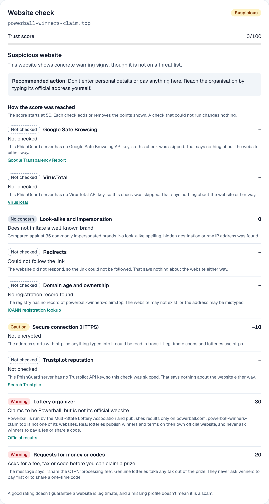
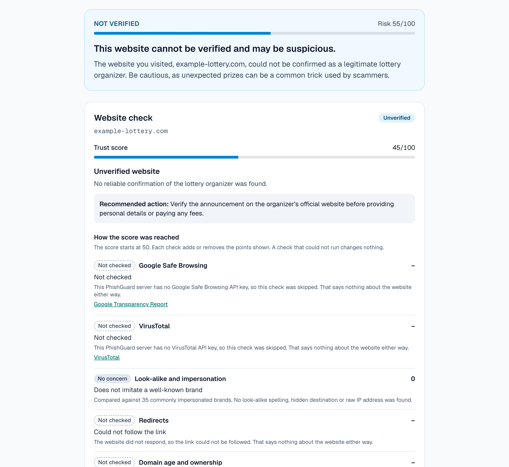
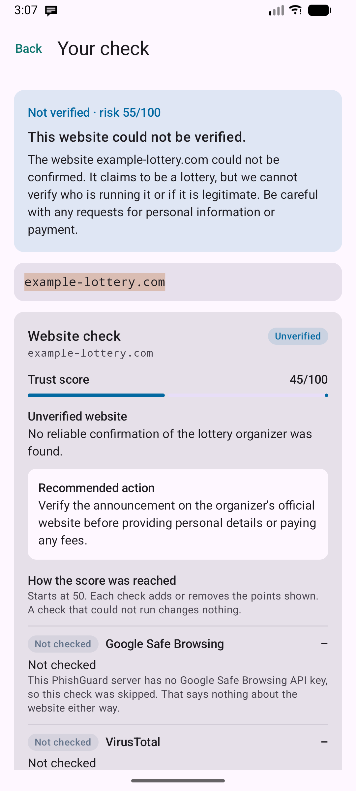
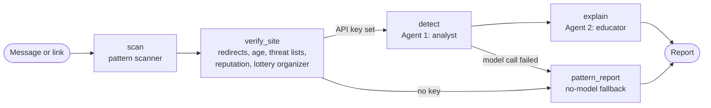

<div align="center">


# PhishGuard

**The explainable security agent.** It doesn't just say "scam": it shows the evidence for every finding and what to do next.

[](https://phishguard.sonu-kumar.in/)
[](https://github.com/notysozu/PhishGuard/actions/workflows/ci.yml)
[](LICENSE)

Next.js · LangGraph · Gemini · Kotlin / Jetpack Compose

</div>

Most phishing filters return a verdict and nothing else, so people never learn
what to look for. PhishGuard is built for non-technical users. Paste a
suspicious email, a text, or a lottery or shopping website address, and it:

- highlights the exact phrases and links that are warning signs,
- verifies the website behind the link against independent sources, and
- explains every finding in plain language, with concrete safety steps.

It separates **confirmed malicious**, **suspicious** and **unverified**, so a
genuine website is not called a scam just because little is known about it. An
Android companion app checks every notification on the phone as it arrives.

## Screenshots

### Web

| Paste a message or link | Explained result |
| --- | --- |
|  |  |

| Website check with an explained trust score | An unverified lottery website |
| --- | --- |
|  |  |

### Android

| Home | Live warning | Why it was flagged | Website check |
| --- | --- | --- | --- |
|  |  |  |  |

All screenshots are from the running apps. In these captures only the Gemini
key was configured, so the Trustpilot, Safe Browsing and VirusTotal rows read
"Not checked". With their keys set, those rows show live results.

## What it does

- **Explains, not just classifies.** Every warning sign is tied to a verbatim
  quote from the message, highlighted in place and numbered.
- **Verifies the website.** For the main link in a message, or a bare address,
  PhishGuard checks:

  | Check | Source | Key needed |
  | --- | --- | --- |
  | Redirect chain and final destination | PhishGuard (HEAD requests only) | no |
  | Look-alike domains, punycode, hidden destinations | PhishGuard | no |
  | Domain age and registrar, owner when public | RDAP, the successor to WHOIS | no |
  | Secure connection | the address itself | no |
  | Known phishing and malware | Google Safe Browsing | yes |
  | Security-vendor verdicts | VirusTotal | yes |
  | Company reviews and rating | Trustpilot Business Units API | yes |
  | Lottery organizer | curated list of official organizer domains | no |
  | Advance fees, upfront taxes, OTP requests | the message text | no |

- **Explainable trust score.** The score starts at 50 and each check adds or
  removes a stated number of points, shown next to its evidence. A check that
  could not run is labelled "Not checked" and changes nothing.
- **Honest about uncertainty.** Four outcomes: *known dangerous* (on a threat
  list), *suspicious* (concrete warning signs), *unverified* (nothing bad,
  nothing confirming it), and *no known problems*. Missing information alone
  never makes a website "dangerous".
- **Lottery and giveaway verification.** A lottery is confirmed only when the
  website belongs to its official organizer. A message that announces a win in
  a real lottery from any other domain is flagged, and the report points to the
  organizer's own results page.
- **Two agents with separate jobs.** A security analyst produces a structured
  verdict. An educator rewrites it in calm, jargon-free language and cannot
  change the verdict or drop a finding.
- **Works without AI.** With no model key, or when the model is out of quota,
  you still get the scanner's findings and the full website check.
- **Live protection on Android.** A notification listener scores each incoming
  notification on the device and posts a warning within seconds. Links and
  messages can also be pasted in, or shared from any app.

### Trustpilot, used carefully

- Looked up through Trustpilot's official API, never scraped.
- A profile counts only when it is filed under the exact domain being checked.
  A similarly named business on another website is ignored.
- A good rating adds a few points and nothing more: it cannot clear a website
  on its own. A missing profile is neutral, not a warning.
- If the lookup fails or no key is set, the row says "Not checked" and no
  profile is assumed.

## How it works



The workflow is a LangGraph `StateGraph` in
[lib/phishguard/graph.ts](lib/phishguard/graph.ts).

| Node | What it does |
| --- | --- |
| `scan` | Deterministic scanner ([signals.ts](lib/phishguard/signals.ts)): look-alike and mismatched domains, digit-for-letter swaps, link shorteners, raw-IP links, spoofed senders, urgency, threats, credential and payment requests. |
| `verify_site` | Verifies the main link ([site/](lib/phishguard/site)) and builds the trust score. Its result is evidence for both agents and is attached to the report. |
| `detect` | Agent 1. Weighs the message, the scanner's hints and the website check, and returns a schema-constrained verdict with verbatim evidence quotes. |
| `explain` | Agent 2. Turns the analyst's findings into plain-language explanations plus safety and recovery steps. |
| `pattern_report` | Builds the report without a model, from the scanner and the website check. |

Two rules sit outside the model, in [report.ts](lib/phishguard/report.ts):

- A threat-list hit always makes the result dangerous, whatever the model says.
- A bare address is rated by the website check alone, so the model cannot
  invent problems with a page it has not seen.

On Android, [PhishNotificationListener](android/app/src/main/java/com/phishguard/app/PhishNotificationListener.kt)
runs a Kotlin port of the scanner on the device. A message is sent to the
server only when the user asks for the full check.

## Project layout

```
app/                    Next.js routes
  page.tsx              The page (server component)
  api/analyze/          NDJSON stream for the web page (shows progress per step)
  api/v1/analyze/       JSON API for the Android app and other clients
components/             UI: form, progress, verdict, highlighted message, website check
hooks/useAnalysis.ts    Client state for one check: request, progress, result
lib/phishguard/
  signals.ts            Deterministic pattern scanner
  graph.ts              LangGraph workflow (nodes and edges only)
  prompts.ts            Agent instructions and untrusted-input fencing
  model.ts              Gemini call with schema-validated output and model fallback
  report.ts             Pure functions that build and rate the final report
  site/
    net.ts              Outbound HEAD requests with SSRF protection
    redirects.ts        Redirect-chain tracing
    intel.ts            RDAP, Trustpilot, Safe Browsing and VirusTotal lookups
    lotteries.ts        Official lottery organizers and known scam themes
    trust.ts            Trust score and classification, with evidence per check
    verify.ts           Orchestrates the checks for one link
  copy.ts               Fallback wording when the AI is unavailable
  request.ts            Input validation and rate limiting
  highlight.ts          Maps evidence quotes onto the message text
  ndjson.ts             Stream reader used by the web client
  types.ts              Zod schemas and shared types
tests/                  Unit, workflow, API-route and component tests
android/                Android app (Kotlin, Jetpack Compose) with its own unit tests
docs/screenshots/       Images used in this README
```

## Run the web app

Requires Node.js 20 or newer.

```bash
npm install
cp .env.example .env.local   # add the keys you have
npm run dev
```

Open http://localhost:3000. Every key is optional. Without any, the scanner,
redirect tracing, domain age, look-alike and lottery checks still run.

| Command | What it does |
| --- | --- |
| `npm run dev` | Start the dev server |
| `npm test` | All tests |
| `npm run test:coverage` | Tests with a coverage report (fails under 90% of lines) |
| `npm run lint` / `npm run typecheck` | ESLint / TypeScript |
| `npm run format` / `npm run format:check` | Prettier |
| `npm run build` | Production build |

| Variable | Purpose |
| --- | --- |
| `GEMINI_API_KEY` | Gemini key used by both agents |
| `PHISHGUARD_MODEL` | Model override (default `gemini-2.5-flash`) |
| `PHISHGUARD_FALLBACK_MODEL` | Tried when the first model is out of quota (default `gemini-2.5-flash-lite`) |
| `TRUSTPILOT_API_KEY` | Trustpilot Business Units API key |
| `GOOGLE_SAFE_BROWSING_API_KEY` | Google Safe Browsing Lookup API v4 key |
| `VIRUSTOTAL_API_KEY` | VirusTotal API v3 key |
| `PHISHGUARD_SITE_CHECKS` | Set to `off` to make no outbound requests about pasted links |

## Testing

`npm test` runs the suite with Node's built-in test runner. No network or API
key is needed: every outside service is replaced by a fake.

- **Scanner**: look-alike domains, digit swaps, mismatched links, spoofed
  senders, and that ordinary messages are left alone.
- **Website check**: the trust score and all four classifications, each
  lookup's found / not found / not configured / failed cases, lottery organizer
  matching, redirect tracing (loops, long chains, redirects to internal
  addresses), and the SSRF guard.
- **Workflow**: the LangGraph graph with a fake model, covering the AI path,
  both fallbacks, schema-breaking model output, a prompt-injection attempt, and
  a threat-list hit overriding a model that called a message safe.
- **API routes**: both endpoints called directly, including 400, 413 and 429.
- **Components**: rendered to HTML to check structure, labels and ARIA
  attributes, and that message text is escaped.

The Android app has its own JUnit tests for the Kotlin scanner, stored-item
encoding and server-response parsing (`./gradlew testDebugUnitTest`). CI runs
both suites on every push.

## Accessibility

- Every state has a text label as well as a colour (verdict, severity, check
  outcome, progress).
- Highlights in the message are links to their explanations, so they work by
  keyboard and screen reader as well as on hover.
- Progress is announced through a live region, and focus moves to the result
  when it arrives.
- Score changes are read out in words ("removes 25 points"), not just symbols.
- Visible focus outlines, a skip link, labelled form controls, and
  `prefers-reduced-motion` is respected.
- On Android, section titles are exposed as headings and status changes are
  announced to TalkBack.

## API

```bash
curl -X POST https://phishguard.sonu-kumar.in/api/v1/analyze \
  -H 'Content-Type: application/json' \
  -d '{"text": "https://example-lottery.com"}'
```

```jsonc
{
  "report": {
    "verdict": "unverified",         // dangerous | suspicious | unverified | likely_safe
    "riskScore": 55,                 // 0-100
    "headline": "…",
    "summary": "…",
    "redFlags": [
      { "category": "suspicious_link", "severity": "high",
        "evidence": "…", "title": "…", "explanation": "…" }
    ],
    "reassuringSigns": [],
    "safetySteps": ["…"],
    "ifAlreadyClicked": ["…"],
    "mode": "ai",                    // "pattern" when the AI was not used
    "site": {                        // present when the text contains a link
      "url": "https://example-lottery.com",
      "finalUrl": "https://example-lottery.com/",
      "domain": "example-lottery.com",
      "classification": "unverified", // confirmed_malicious | suspicious | unverified | no_known_issues
      "trustScore": 45,               // 0-100, starts at 50
      "headline": "Unverified website",
      "summary": "No reliable confirmation of the lottery organizer was found.",
      "recommendedAction": "Verify the announcement on the organizer's official website before providing personal details or paying any fees.",
      "checks": [
        { "id": "domain_age", "label": "Domain age and ownership",
          "outcome": "unavailable",   // good | neutral | caution | bad | unavailable
          "summary": "…", "evidence": "…", "impact": 0,
          "source": { "name": "ICANN registration lookup", "url": "…" } }
      ],
      "redirectChain": ["https://example-lottery.com"]
    }
  }
}
```

Errors return `{ "error": "…" }` with a 4xx or 5xx status. Input is limited to
20,000 characters.

## Run the Android app

Requires the Android SDK and JDK 17–24.

```bash
cd android
./gradlew installDebug
```

Open the app, tap **Turn on** and enable PhishGuard under notification access.
Paste a link under **Check a website or message**, or tap **Send a test** to
see a live warning. More detail in [android/README.md](android/README.md).

## Deploy

The web app deploys to Vercel as-is:

```bash
npx vercel
npx vercel env add GEMINI_API_KEY production   # repeat for the other keys you have
npx vercel --prod
```

## Security and privacy

- **Your device never opens a pasted link.** The server follows a link's
  redirects with HEAD requests only, so nothing is downloaded, rendered or
  run. The Android app's on-device scanning opens nothing at all.
- **SSRF protection.** Outbound requests go only to public addresses, over
  http(s) on default ports. Loopback, private, link-local and cloud-metadata
  ranges are refused, including when written in decimal, hex or IPv6-mapped
  form. The check runs at connection time, so a hostname cannot pass and then
  resolve somewhere else, and it is repeated on every redirect.
- **Minimal data to third parties.** Reputation services receive the domain,
  or the address with its query string removed. The message text is never sent
  to them.
- **Prompt-injection aware.** The submitted message is treated as hostile
  input: it is wrapped in tags, and both agents are told to ignore instructions
  inside it and to report such attempts as a warning sign.
- **Guard rails outside the model.** A threat-list hit cannot be talked down,
  a bare address cannot be talked up or down, and the explainer cannot add or
  remove findings.
- **Constrained output.** Agent responses must match a JSON schema and are
  validated with zod before use. React escapes everything that is rendered,
  and a checked address is shown as text, never as a link.
- **Nothing is stored on the server.** No database, no logging of message text.
- **On-device first on Android.** Notifications are scored on the phone.
  Ones that look fine are counted and discarded; only the last 50 flagged ones
  are kept, in app-private storage.
- **Abuse limits.** Input length cap, one link verified per request, at most
  six redirects, and a per-IP rate limit on the API.
- **Off switch.** `PHISHGUARD_SITE_CHECKS=off` disables every outbound request
  about a pasted link.

## Limitations

- Three checks need API keys the deployer must supply. Trustpilot API keys are
  issued through a Trustpilot Business account.
- The lottery list covers a small set of major organizers. An organizer that is
  not on it is reported as unverified, not as fake.
- "Winner lists and terms" are verified by confirming the organizer's domain
  and linking to its results page. PhishGuard does not read a page to look for
  a specific winner.
- Redirects performed by scripts or page content are not followed, because no
  page is ever loaded.
- Registration data is unavailable for some country domains, and owner details
  are usually private.
- The rate limit is held in memory per server instance, so it is weak on
  serverless. A shared store would be needed for real traffic.
- Live detection on Android is rule-based. A scam with no suspicious link or
  stock phrase is only caught by the server's check.
- The scanner's brand list and phrase patterns are English-centric.
- PhishGuard gives guidance, not a guarantee.

## License

[MIT](LICENSE)
